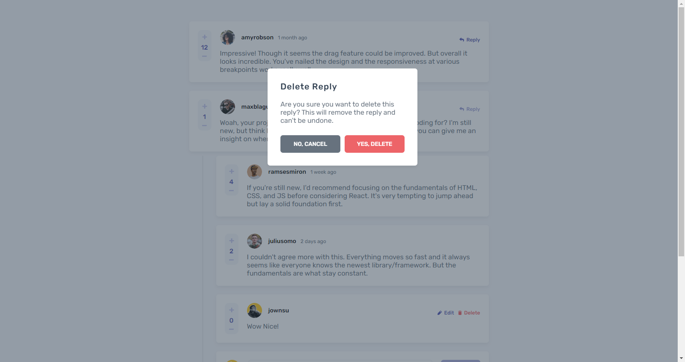

# Frontend Mentor - Interactive comments section solution

This is a solution to the [Interactive comments section challenge on Frontend Mentor](https://www.frontendmentor.io/challenges/interactive-comments-section-iG1RugEG9). Frontend Mentor challenges help you improve your coding skills by building realistic projects. 

### The challenge

Users should be able to:

- View the optimal layout for the app depending on their device's screen size
- See hover states for all interactive elements on the page
- Create, Read, Update, and Delete comments and replies
- Upvote and downvote comments

### Screenshot

This challenge posed a significant intellectual hurdle, but I was determined to rise to the occasion and develop a comment section that was not only interactive but also engaging and user-friendly. As you can see from the screenshot, I believe that I have accomplished just that.

My solution incorporates a range of interactive features, including upvoting and downvoting, which allow users to express their opinions and engage in lively debate. In addition, I have implemented a reply function, which promotes a sense of community and fosters conversation.

I have also prioritized user experience in my design, ensuring that the comment section is intuitive and easy to navigate. Whether users are posting their own comments or responding to others, I believe that my solution offers a seamless and enjoyable experience.

I am proud of the hard work and dedication that went into developing this solution, and I am eager to share it with you. I believe that it represents the pinnacle of interactive comment section design, and I look forward to hearing your thoughts and feedback.

Thank you for allowing me to showcase my work, and I hope that my solution inspires you as it has inspired me.

### Links

- Live Site URL: [interactive-comments-section](https://interactive-comments-section-jownsu.vercel.app/)

### Built with

- Semantic HTML5 markup
- CSS custom properties
- SASS/SCSS
- [React](https://reactjs.org/) - JS library

## Author

- Website - [Jownsu](https://jownsu.github.io/)
- Frontend Mentor - [@jownsu](https://www.frontendmentor.io/profile/jownsu)
- Instagram - [jownsu](https://www.instagram.com/jownsu/)
- Linked In - [Jhones](https://www.linkedin.com/in/jhones-digno-866904213/)
